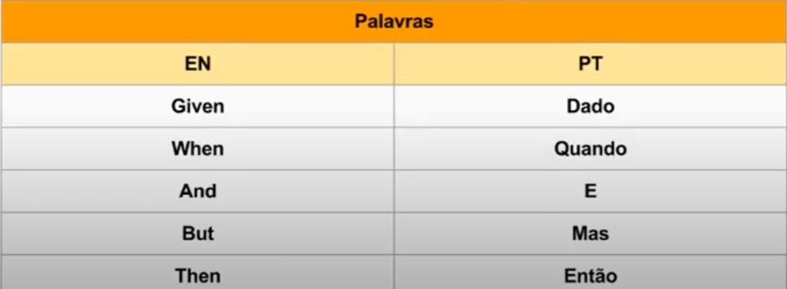

 
# Testes de Especificação
### Prof. Dr. Valério Gutemberg
#### :pencil: Andriéria, Bruno Pithon, Guilherme Aurélio, João Paulo e Kelvin
#### :pencil: Disciplina de Testes de Software
:pencil2: Curso de Sistemas para Internet


---

# O que são Testes de Especificação?

Testes de especificação são um tipo de teste de software que verifica se o sistema ou componente está em conformidade com as especificações definidas, ou seja, se ele atende aos requisitos funcionais e não funcionais estabelecidos para o projeto, sem se preocupar com a implementação interna.Esses testes são essenciais para garantir que o software entregue atenda às necessidades do cliente e funcione conforme o esperado em cenários reais.

---

# Características dos Testes de Especificação

- Baseados nas **funcionalidades descritas** nos requisitos do sistema.
- Geralmente são realizados como **testes de caixa preta**, os detalhes de implementação interna do software são desconhecidos.
- Frequentemente cobrem **diversos cenários de uso**, incluindo entradas válidas, inválidas e limites.
- Podem ser **automatizados**, para verificação ao longo do ciclo de desenvolvimento.

---

# Por que Testes de Especificação são importantes?

- **Validação precisa** para assegurar a conformidade com os requisitos definidos.
- Garantem que as **necessidades do cliente** estão sendo atendidas.
- Utilizam linguagens comuns ou formatos que podem ser entendidos por **desenvolvedores, testadores, gerentes de projeto e stakeholders não técnicos**.
- **Feedback imediato** sobre a conformidade do código com as especificações.
- Ajudam a **diminuir riscos relacionados a falhas no produto**, principalmente em situações onde a conformidade regulatória é crítica. 

---

# Vantagens

- Ajudam a **evitar desentendimentos** entre desenvolvedores, testadores e stakeholders.
- **Reduzem a ambiguidade** pois é o mesmo conjunto de requisitos.
-  Erros e omissões nos requisitos **podem ser identificados cedo** no processo.
-  Testes automatizados **podem ser reutilizados** ao longo do ciclo de vida do software.

---

# Desvantagens

-  Se os requisitos forem mal definidos, **a eficácia dos testes será negativa**.
- Definir testes de especificação detalhados **pode ser demorado e custoso**.
- Problemas de implementação podem **não ser identificados**. 
- Se as especificações dos cenários possíveis não forem abordadas adequadamente, ocorrerá **falhas em situações imprevistas**.
---

# Quando usar Testes de Especificação?
- Quando os requisitos **são claros e bem definidos**.
- Quando **é necessário alinhamento** entre equipes técnicas e não técnicas.
- Em projetos onde **a qualidade e a conformidade são críticas**.


---

# Quando NÃO usar Testes de Especificação?
- Quando os **requisitos são muito voláteis ou mal definidos**.
- Em projetos **muito pequenos ou simples**.
- Quando há **pouco tempo para desenvolvimento e testes**.

---

# Introdução a BDD, Gherkin e Behave
- **Behavior-Driven Development (BDD)** é uma metodologia de desenvolvimento de software que visa melhorar a colaboração entre desenvolvedores, testadores e stakeholders não técnicos (como gerentes de produto ou clientes). A principal ideia do BDD é que o comportamento do software deve ser definido de maneira clara e compreensível por todos os envolvidos no projeto.

- **Gherkin** é uma linguagem de domínio específico (DSL) usada em BDD para escrever testes de especificação em uma forma que seja legível tanto por pessoas técnicas quanto não técnicas. Gherkin usa uma sintaxe simples baseada em texto, geralmente organizada em torno de estruturas "Given-When-Then".


---

- **Behave** é uma biblioteca de BDD para Python que permite a implementação de testes baseados em especificações escritas em Gherkin. Com Behave, os cenários definidos em Gherkin são implementados como testes automatizados, permitindo verificar se o software se comporta conforme o esperado.


---

# Características do BDD, Gherkin e Behave

- **BDD** - se concentra em como o software deve se comportar em vez de como ele é implementado e é utilizada uma linguagem comum, geralmente em um formato legível por humanos, como o Gherkin.

- **Gherkin** - baseia-se na seguinte sintaxe:
◦ Given - define o contexto inicial ou as condições preexistentes para o teste.
◦ When - descreve a ação ou evento que está sendo testado.
◦ Then - define o resultado esperado ou a saída após a ação ser executada.

---

- **Behave** - as especificações são escritas em arquivos .feature usando Gherkin, onde cada etapa do cenário (Given, When, Then) é mapeada para uma função Python, conhecida como "step", que implementa a lógica específica do teste, como a lógica de cadastro, por exemplo. Em seguida, o Behave executa os cenários definidos e reporta os resultados, validando se o comportamento do sistema está de acordo com as especificações.
---

# Visão geral


---

# Exemplo Prático: Behave + Gherkin
1. **Criação do Arquivo de Especificação (.feature)**: escreve as especificações em um arquivo .feature usando a sintaxe Gherkin.
2. **Definição dos Steps em Python**: cria um arquivo Python na pasta steps/ (por exemplo, steps/login_steps.py) para implementar a lógica dos steps. Cada step do Gherkin (Given, When, Then) deve ser mapeado para uma função Python correspondente.
3. **Execução dos testes**: navega até a pasta onde estão localizados os arquivos .feature e executa o Behave.

---


###### Arquivo (.feature)

```python
Feature: Cadastro e Gerenciamento de Usuários
  Como administrador do sistema
  Eu quero poder gerenciar usuários
  Para que eu possa manter as informações de usuários atualizadas e remover usuários quando necessário

  Scenario Outline: Cadastro de um novo usuário com sucesso
    Given que não há usuários cadastrados
    When eu cadastro um usuário com nome "<name>" e email "<email>"
    Then o sistema deve registrar o usuário "<name>" com o email "<email>"
    And o sistema deve ter 1 usuário cadastrado
    And o sistema não deve retornar nenhum erro

    Examples:
      | name       | email                    |
      | Guilherme  | Guilherme@example.com    |
      | Andrieria  | Andrieria@example.com    |
      | Kelvin     | Kelvin@example.com       |
      | João Paulo | JoãoPaulo@example.com    |
      | Bruno      | Bruno@example.com        |
```

---

###### Arquivo .py em steps/

```python
@given('que não há usuários cadastrados')
def step_impl(context):
    context.user_manager = UserManager()

@when('eu cadastro um usuário com nome "{name}" e email "{email}"')
def step_impl(context, name=None, email=None):
    try:
        if name:
            context.user = context.user_manager.add_user(name, email)
        else:
            context.user_manager.add_user("Nome Placeholder", email)
        context.error = None
    except UserAlreadyExistsError as e:
        context.error = str(e)
```

---
###### Arquivo .py em steps/
```python
@then('o sistema deve registrar o usuário "{name}" com o email "{email}"')
def step_impl(context, name, email):
    user = context.user
    assert user.name == name
    assert user.email == email

@then('o sistema deve ter {count} usuário cadastrado')
def step_impl(context, count):
    assert len(context.user_manager.get_users()) == int(count)

@then('o sistema não deve retornar nenhum erro')
def step_impl(context):
    assert context.error is None
```
---

###### Arquivo (.feature)

```python
Scenario Outline: Tentativa de cadastro de um usuário com email já registrado
  Given que o usuário "<existing_name>" com email "<existing_email>" está cadastrado
  When eu cadastro um usuário com nome "<new_name>" e email "<existing_email>"
  Then o sistema deve retornar um erro dizendo que o email já está registrado

  Examples:
    | existing_name | existing_email        | new_name |
    | Maria         | maria@example.com     | Pedro    |
    | Ana           | ana@example.com       | João     |

```
---
###### Arquivo .py em steps/

```python
@given('que o usuário "{name}" com email "{email}" está cadastrado')
def step_impl(context, name, email):
    context.user = context.user_manager.add_user(name, email)

@when('eu cadastro um usuário com nome "{name}" e email "{email}"')
def step_impl(context, name=None, email=None):
    try:
        if name:
            context.user = context.user_manager.add_user(name, email)
        else:
            context.user_manager.add_user("Nome Placeholder", email)
        context.error = None
    except UserAlreadyExistsError as e:
        context.error = str(e)
```
---
###### Arquivo .py em steps/
```python
@then('o sistema deve retornar um erro dizendo que o email já está registrado')
def step_impl(context):
    assert context.error is not None
    assert "já está registrado" in context.error
```

---

###### Arquivo (.feature)

```python
 Scenario Outline: Atualização de informações do usuário
    Given que o usuário "<old_name>" com email "<old_email>" está cadastrado
    When eu atualizo o nome do usuário para "<new_name>" e o email para "<new_email>"
    Then o sistema deve atualizar o usuário para o nome "<new_name>" e o email "<new_email>"

    Examples:
      | old_name | old_email             | new_name | new_email              |
      | Maria    | maria@example.com     | Maria S. | maria.s@example.com    |
      | João     | joao@example.com      | João P.  | joao.p@example.com     |
```
---

###### Arquivo .py em steps/
```python
@given('que o usuário "{name}" com email "{email}" está cadastrado')
def step_impl(context, name, email):
    context.user = context.user_manager.add_user(name, email)

@when('eu atualizo o nome do usuário para "{new_name}" e o email para "{new_email}"')
def step_impl(context, new_name, new_email):
    try:
        context.user = context.user_manager.update_user(context.user.email, new_name, new_email)
        context.error = None
    except (UserAlreadyExistsError, UserNotFoundError) as e:
        context.error = str(e)

@then('o sistema deve atualizar o usuário para o nome "{new_name}" e o email "{new_email}"')
def step_impl(context, new_name, new_email):
    assert context.user.name == new_name
    assert context.user.email == new_email


```

---

###### Arquivo (.feature)

```python
  Scenario: Remoção de um usuário
    Given que o usuário "Ana" com email "ana@example.com" está cadastrado
    When eu removo o usuário com email "ana@example.com"
    Then o sistema não deve ter nenhum usuário com email "ana@example.com"
```
---
###### Arquivo .py em steps/
```python
@given('que o usuário "{name}" com email "{email}" está cadastrado')
def step_impl(context, name, email):
    context.user = context.user_manager.add_user(name, email)

@when('eu removo o usuário com email "{email}"')
def step_impl(context, email):
    try:
        context.user_manager.remove_user(email)
        context.error = None
    except UserNotFoundError as e:
        context.error = str(e)

@then('o sistema não deve ter nenhum usuário com email "{email}"')
def step_impl(context, email):
    users = context.user_manager.get_users()
    assert all(user.email != email for user in users)
```


---
###### Arquivo (.feature)

```python
  Scenario: Tentativa de atualização de usuário inexistente
    Given que não há usuários com o email "naoexistente@example.com"
    When eu tento atualizar o usuário com o email "naoexistente@example.com"
    Then o sistema deve retornar um erro dizendo que o usuário não foi encontrado
```

---
###### Arquivo .py em steps/

```python
@given('que não há usuários com o email "{email}"')
def step_impl(context, email):
    users = context.user_manager.get_users()
    assert all(user.email != email for user in users)

@when('eu tento atualizar o usuário com o email "{email}"')
def step_impl(context, email):
    try:
        context.user = context.user_manager.update_user(email, "Novo Nome", "novoemail@example.com")
        context.error = None
    except UserNotFoundError as e:
        context.error = str(e)

@then('o sistema deve retornar um erro dizendo que o usuário não foi encontrado')
def step_impl(context):
    assert context.error is not None
    assert "não encontrado" in context.error
```
---

# Conclusão

Testes de especificação são essenciais para garantir que o software desenvolvido esteja alinhado com os requisitos, principalmente em projetos com alta criticidade e onde a automação de testes pode trazer benefícios significativos, reduzindo a probabilidade de erros, facilitando a comunicação entre as partes interessadas, suportando metodologias modernas de desenvolvimento e contribuindo para a qualidade geral e a confiabilidade do software. 

Behave, Gherkin e BDD formam uma poderosa combinação para escrever testes de especificação que são claros, compreensíveis e executáveis, facilitando a colaboração, comunicação entre equipes e resultando em um produto final que atende melhor às expectativas dos stakeholders.


---

# Obrigado!

Dúvidas?

